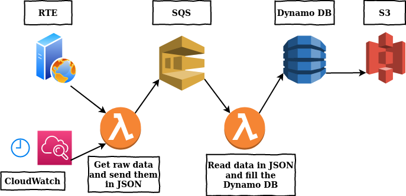

# Project Serverless, Part Two
Simple setup for a dashboard hosted in S3 with lambda functions, Sqs and Dynamo DB, from a website

### What you will know

### Dashboard
The [dashboard](https://github.com/Ulysse-C/Projet_Serverless/blob/master/AWS/code/staticWebsite.html) is a public webpage hosted in Amazon S3 service. The page access to the DynamoDB and scans the data by a [Javascript script](https://github.com/Ulysse-C/Projet_Serverless/blob/master/AWS/code/staticWebsite.js) using the [Javascript AWS SDK](https://aws.amazon.com/fr/sdk-for-browser/). The data are displayed in colored and dynamic graphs made with Chart.js.

### From Web to SQS
[This](https://github.com/Ulysse-C/Projet_Serverless/blob/master/AWS/code/fromWebtoSqs.py) lambda function requests data from RTE's website. The data is pulled with the package, transformed from XML to JSON with xmltodict and is finally sent to the SQS.

### From SQS to DynamoDB
[This](https://github.com/Ulysse-C/Projet_Serverless/blob/master/AWS/code/fromSqstoDynamo.js) functions parse the JSON data. Then for each value, it creates an add-request for the database and fills it.
