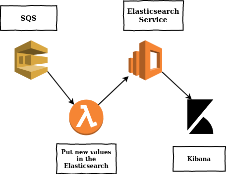

# Project Serverless, Part Three
Simple setup for a Kibana dashboard with ElasticSearch Service

### What you will know

### From DynamoDB to ElasticSearch Service
The dynamoDB already created is used as trigger for a new lambda function, to send the ElasticSearch Service (ES), this function needs a role, with access to the DynamoDB, and the ES

### Kibana Dashboard
Connect to your Elasticsearch data with the connection with their index, then use the pannels on the left side to create dashboard and visualisations 