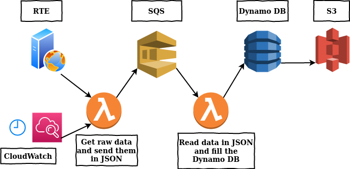

# Project Serverless, Part Two
Simple setup for updating a Aws DynamoDB with lambda functions and Sqs

### What you will know

### Dashboard
The dashboard is a public webpage hosted in Amazon S3 service. The page access to the DynamoDB et scans the data via the Javascript AWS SDK. The data are displayed in colored and dynamic graphs made with Chart.js.

### Using external packages in lambda functions
For one of the functions of this part, you will need to use an external package, to do so, I will recommend to use AWS CLI to make the operation of upload the zip with the function and the packages easier, see the official doc for more informations.

### From Web to SQS
The simplest lambda function. It requests data from RTE's website. The data is pulled with the package, transformed from XML to JSON with xmltodict and is finally sent to the SQS.

### From SQS to DynamoDB
This functions parse the JSON data. Then for each value, it creates an add-request for the database and fills it.

### Note
All the code is available in the **Code_Part_Two** folder.
