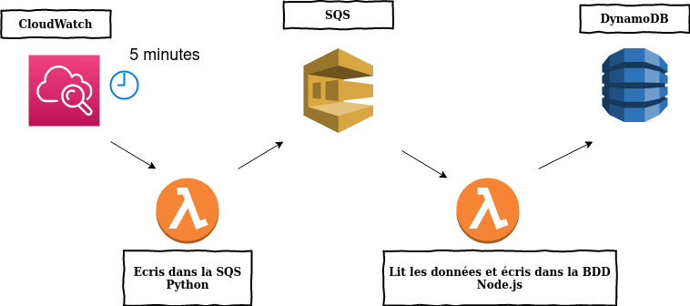

# Project Serverless
Simple setup for updating a Aws DynamoDB with lambda functions and Sqs

### What you will know


### Sqs & Dynamo DB
Nothing more than the basic creation of Aws, note somewhere the name and the arn of the services you just created.

### Roles
You will need to create two new roles with IAM for your lambda functions, so you will chose the use case "Lambda".
Both will need the policy : AWSLambdaBasicExecutionRole
Then we added the policy : AWSLambdaSQSQueueExecutionRole (but I think it is possible to limit the permissions to the sqs we are using only)
And, for the lambda function interacting with the dynamo DB, add a inline policy, for the service dynamoDB, select the actions "PutItem" and "GetItem", finally, chose the dynamoDB you want to interact with as ressource, with it arn.
### lambda functions
```js
def send_sqs_message(QueueName, msg_body):
    sqs = boto3.resource('sqs')
    queue = sqs.get_queue_by_name(QueueName = QueueName)
    # Send the SQS message
    param = "name "
    param += str(msg_body)
    data = {
        "Records": [
    {
      "idMessage": param,
      "number": msg_body
    }
    ]
    }
    print(data)
    try:
        response = queue.send_message(MessageBody = json.dumps(data))
    except ClientError as e:
        logging.error(e)
        return None
    return response
```
```js
const AWS = require('aws-sdk');
AWS.config.update({region: "eu-west-3"});
exports.handler = async (event, context, callback) => {
    const ddb = new AWS.DynamoDB({apiVersion: "2012-10-08"});
    const documentClient = new AWS.DynamoDB.DocumentClient({region: "eu-west-3"});
    console.log(event.Records);
    for(const {messageId, body} of event.Records){
        const obj = JSON.parse(body);
        for(const {idMessage, number} of obj.Records){
            const params = {
            TableName: "Test",
            Item: {
              id: idMessage,
              numberGeneated: number
            }
            }
            try {
                const data = await documentClient.put(params).promise();
                console.log(data);
            }catch(err) {
                console.log(err);
            }
        }
    }
    } 
```
here, the dynamo table has two Items,and the name "Test", id and numberGeneated, you can change the name and the amount if you do it everywere (the two functions and the Dynamo DB)

### Event
For a lambda function triggered with a timer, use the service CloudWatch, in Event/Rules, create a new rule with the trigger you want, for this example, chose schedule and the time you want, on the right pannel, add your lambda function as target.
For the moment, the input in the database is independent of the trigger, but that will come later.
