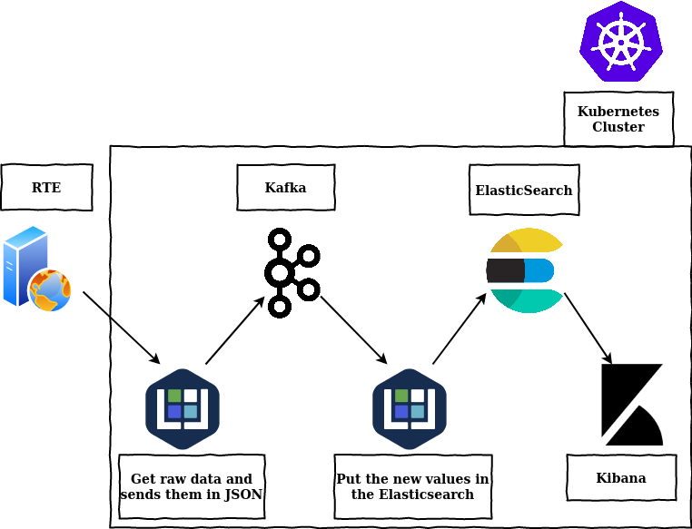

# Project Serverless, Part Four
Simple setup for a Kibana dashboard with ElasticSearch on a private cluster

### What you will know

### From Web to Kafka
The Kafka used is a [kubeless distribution](https://github.com/kubeless/kafka-trigger/releases) for a easy use of triggers.
The data are send in a topic "rte-france", in a json format.

### From Kafka to ElasticSearch
The function is triggered by kubeless, it is an adaptaion of the one for [AWS](https://github.com/Ulysse-C/Projet_Serverless/tree/master/AWS/codefromSqstoElastic.py)

### Kibana Dashboard
Same as in AWS, connect your Elasticsearch data with the "Connect to your Elasticsearch index" option, then use the pannels on the left side to create dashboard and visualisations, verify that the type of your values are recognized by kibana (especialy date or number) to allow a smooth visualisation creation.
